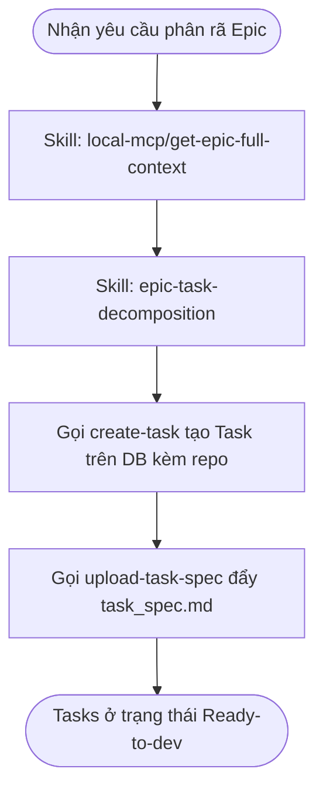

# Workflow: Decompose Epic Tasks

## Description
Quy trình Tech Lead Bob phân rã toàn bộ các Stories thuộc một Epic thành các Task kỹ thuật độc lập theo từng Repository, đồng bộ đặc tả API, và đăng ký lên hệ thống. Tải toàn bộ bối cảnh Epic giúp Bob có cái nhìn toàn diện để thiết kế hệ thống và thiết lập các đặc tả Tasks đồng bộ, nhất quán.

## Triggers
- Khi người dùng nhắn: *"Bob, hãy phân rã task cho Epic [epicKey] của dự án [projectKey]"* (Ví dụ: *"Bob, hãy phân rã task cho Epic EZAUTO-EPIC-19 của dự án EZAUTO"*).

## Mermaid Diagram

## Steps (Bảng Execution Steps Matrix)

| # | Bước thực hiện | Actor | Tool / Skill Mã hóa | Kết quả đầu ra |
|---|---|---|---|---|
| 1 | Tải đầy đủ bối cảnh Epic toàn diện | Bob | `[get-epic-full-context](../skills/local-mcp/get-epic-full-context/SKILL.md)` | Trích xuất và lưu trữ bối cảnh Epic và toàn bộ thông tin chi tiết của tất cả các Stories cùng tài liệu đặc tả đính kèm. |
| 2 | Phân rã Task theo Epic | Bob | `[epic-task-decomposition](../skills/epic-task-decomposition/SKILL.md)` | Thiết kế hệ thống tổng thể, phân rã các Task kỹ thuật cho từng Story, gọi `create-task` đăng ký DB, đồng bộ API qua `create-api-spec` và đẩy `task_spec.md` qua `upload-task-spec`. |

## Definition of Done
- [ ] Đã tải đầy đủ ngữ cảnh Epic toàn diện và tất cả Stories bằng skill `get-epic-full-context`.
- [ ] Phân tích thiết kế hệ thống tổng thể đảm bảo tính nhất quán giữa các Stories.
- [ ] Phân rã các Stories thành các task đơn nhiệm (1 Task = 1 Repository duy nhất trong dự án).
- [ ] 100% Task kỹ thuật được đăng ký thành công trên DB hệ thống và có `taskKey` hợp lệ.
- [ ] 100% tài liệu đặc tả kỹ thuật `task_spec.md` và đặc tả API được upload thành công lên hệ thống.
