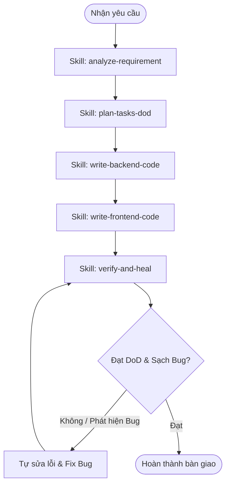

# Workflow: local-app-development

## Description
Quy trình phát triển ứng dụng local hoàn chỉnh (Full Stack) từ khi nhận yêu cầu thô, làm rõ yêu cầu, phân rã công việc kèm theo Definition of Done (DoD), viết Backend (Express), Frontend (React+Tailwind), và kiểm thử tích hợp tự sửa lỗi (Fix bug/Self-healing).

## Triggers
- Khi nhận được yêu cầu phát triển ứng dụng local từ người dùng.

## Mermaid Diagram

## Steps (Bảng Execution Matrix)
| # | Bước (Action) | Actor | Tool/Skill mã hóa | Kết quả đầu ra (Output) |
|---|---|---|---|---|
| 1 | Tiếp nhận và làm rõ Specs/Prompt | Agent | `[Analyze Requirement](../skills/analyze-requirement/SKILL.md)` | Đặc tả yêu cầu chi tiết thống nhất `finalized_specs` |
| 2 | Phân rã task (API, UI, Config, Bug) và viết DoD | Agent | `[Plan Tasks & DoD](../skills/plan-tasks-dod/SKILL.md)` | Danh sách task kèm DoD và chiến lược chia file `tasks_list` |
| 3 | Viết Backend Node.js/Express tích hợp API | Agent | `[Write Backend Code](../skills/write-backend-code/SKILL.md)` | Mã nguồn Backend chạy thử được ở local, kết nối với BE chính |
| 4 | Viết Frontend React + Vite + Tailwind CSS | Agent | `[Write Frontend Code](../skills/write-frontend-code/SKILL.md)` | Giao diện FE responsive, kết nối API local, code được chia nhỏ |
| 5 | Tích hợp, build thử và tự sửa lỗi (Fix bug) | Agent | `[Verify & Heal](../skills/verify-and-heal/SKILL.md)` | Báo cáo kiểm thử `test_report` thành công, không còn lỗi nghiêm trọng |

## Definition of Done
- [ ] Đặc tả yêu cầu `finalized_specs` được làm rõ hoàn toàn, xác định rõ nguồn API BE chính.
- [ ] Danh sách task phân rã chi tiết kèm DoD cụ thể cho từng cấu phần và chiến lược tách file.
- [ ] Backend code được tách biệt thành routes, controllers, helpers, không viết tập trung.
- [ ] Frontend code được chia nhỏ thành các components tái sử dụng, không dồn logic.
- [ ] Cấu hình API Token và Base URL được bảo mật qua `.env`, không hardcode.
- [ ] Khởi chạy tích hợp local thành công (không có lỗi CORS hay crash).
- [ ] Test report xác nhận tất cả tính năng hoạt động đúng theo DoD và không còn bug nghiêm trọng.
