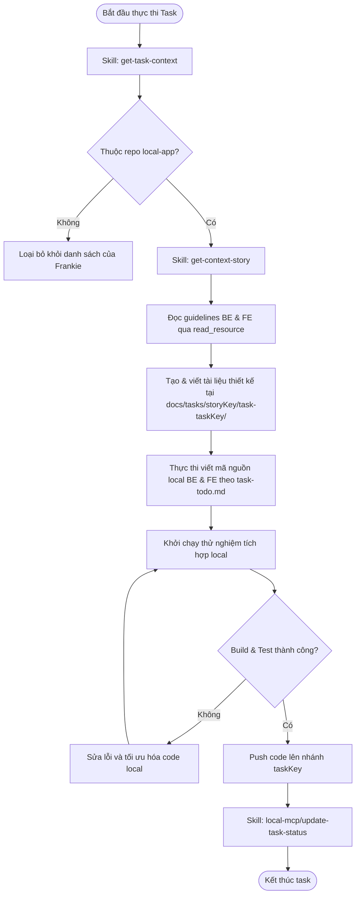

# Workflow: Task Execution

## Description
Quy trình hướng dẫn Frankie nhận nhiệm vụ Fullstack Local thông qua taskKey, lấy đặc tả kỹ thuật của task và nghiệp vụ của story, lập tài liệu thiết kế và kế hoạch chi tiết, thực thi viết code Backend (Express) và Frontend (React) local, chạy kiểm thử tích hợp, sau đó push code lên nhánh taskKey và cập nhật trạng thái hoàn thành lên hệ thống.

## Triggers
- **Manual Command:** Khi nhận được chỉ thị thực thi một task cụ thể từ hệ thống hoặc PM.
  > *Ví dụ: "Hãy tiến hành thực thi task [taskKey]."*

## Mermaid Diagram

## Steps (Bảng Execution Matrix)

| # | Bước (Action) | Actor | Tool/Skill mã hóa | Kết quả đầu ra (Output) |
|---|---|---|---|---|
| 1 | Lấy thông tin chi tiết và file đặc tả `task-spec.md` của Task | Frankie | `[get-task-context](../skills/local-mcp/get-task-context/SKILL.md)` | Đối tượng dữ liệu `taskContext` (chứa `storyKey`, `title`, `priority` và nội dung đặc tả kỹ thuật) |
| 2 | Xác thực ranh giới repository | Frankie | logic kiểm tra ranh giới repo | Xác nhận task thuộc repo `local-app`. Nếu không đúng, dừng workflow và báo cáo lại. |
| 3 | Lấy ngữ cảnh chi tiết và nghiệp vụ của User Story | Frankie | `[get-context-story](../skills/local-mcp/get-context-story/SKILL.md)` | Đối tượng dữ liệu `storyContext` (chứa yêu cầu nghiệp vụ, specs của story) |
| 4 | Đọc các tài liệu guideline cấp độ TASK_BE và TASK_FE | Frankie | Gọi `local-mcp:read_resource` với các URI: - `guideline://TASK_BE/task-spec.md` - `guideline://TASK_FE/task-todo.md` | Các mẫu tài liệu đặc tả Backend & Frontend chuẩn |
| 5 | Viết tài liệu thiết kế, luồng xử lý và kế hoạch thực hiện cho task | Frankie | File System Tools | 4 tệp tài liệu được lưu tại `./docs/tasks/[storyKey]/task-[taskKey]/`: - `task_spec.md` (đồng bộ từ hệ thống) - `logic_flow.md` - `task-todo.md` - `acceptance_criteria.md` |
| 6 | Thực thi viết mã logic Backend và Frontend local | Frankie | `[Write Backend Code](../skills/write-backend-code/SKILL.md)` & `[Write Frontend Code](../skills/write-frontend-code/SKILL.md)` | Mã nguồn local Express và React chạy ổn định |
| 7 | Khởi chạy tích hợp và kiểm thử | Frankie | `[Verify & Heal](../skills/verify-and-heal/SKILL.md)` | Khởi chạy thành công local không lỗi CORS hay crash |
| 8 | Đẩy mã nguồn lên Git và cập nhật trạng thái Task | Frankie | Git command / Skill `[update-task-status](../skills/local-mcp/update-task-status/SKILL.md)` | Thực hiện push code lên Git với tên nhánh là `[taskKey]`, sau đó gọi skill `local-mcp/update-task-status` với `status = DONE` và `taskKey = [taskKey]` để cập nhật trạng thái task lên hệ thống. |

## Definition of Done
- [ ] Lấy thành công thông tin đặc tả và tài liệu `task-spec.md` từ hệ thống qua `get-task-context`.
- [ ] Lấy thành công thông tin nghiệp vụ và ngữ cảnh của Story qua `get-context-story`.
- [ ] Xác nhận task thuộc phạm vi repository hiện tại (`local-app`).
- [ ] Đã tạo và viết đầy đủ 4 tài liệu đặc tả (`task_spec.md`, `logic_flow.md`, `task-todo.md`, `acceptance_criteria.md`) tại thư mục local `./docs/tasks/[storyKey]/task-[taskKey]/`.
- [ ] Logic Backend Express và Frontend React local được triển khai modular, chia nhỏ file đúng chuẩn.
- [ ] Khởi chạy tích hợp local thành công và không còn lỗi nghiêm trọng.
- [ ] Mã nguồn đã được push lên Git với tên nhánh là `[taskKey]` và cập nhật trạng thái task thành `DONE` qua skill `local-mcp/update-task-status` thành công.
