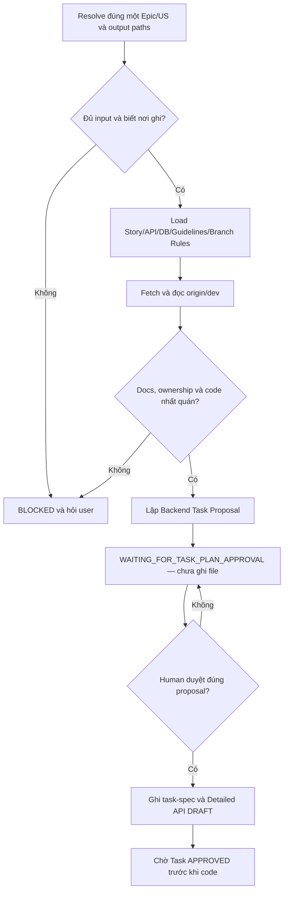

# Workflow: Decompose Backend Tasks for One Story

## Trigger

User yêu cầu phân rã một `<EPIC>/<US>` cụ thể thành Backend Tasks.
Không dùng workflow này cho toàn Epic hoặc nhiều US.

## Required Skills

Theo đúng thứ tự:

1. `get-context-story`
2. `inspect-repository-context`
3. `plan-backend-story-tasks`
4. `create-api-spec` — chỉ ở Write phase

## Flow



## Phase 1: Proposal

1. Xác nhận duy nhất Project root, Epic ID, Story ID, Task output directory, Detailed API surface và directory.
2. Nếu user đưa Epic nhưng thiếu US, hoặc nhiều US, trả `BLOCKED_SCOPE` và yêu cầu một US cụ thể.
3. Nếu không xác định duy nhất output path, trả `BLOCKED_OUTPUT_PATH` và hỏi user; chưa tạo file.
4. Dùng `get-context-story`; đọc Epic Brief, Story package, API/DB documents và approval state.
5. Đọc `TASK_BE/task-spec.md`, `TASK_BE/detailed-api-spec.md`, repository guidelines và `story-task-branch-rules.md`.
6. Fetch `origin/dev`; dùng `inspect-repository-context` để đọc code trực tiếp từ baseline, không lấy current working tree làm baseline thay thế.
7. Tìm implementation liên quan và lập `Method + Endpoint → owner`.
8. Mâu thuẫn hoặc ownership chưa rõ thì dừng.
9. Dùng `plan-backend-story-tasks` lập Task Proposal cho đúng US.
10. Trình Task matrix gồm Task, endpoint/foundation scope, objective, dependency, sensitive impact và output paths.
11. Trả `WAITING_FOR_TASK_PLAN_APPROVAL`; không ghi file.

## Phase 2: Write

Chỉ chạy khi user duyệt rõ Task Proposal hiện có.

1. Xác nhận proposal được duyệt đúng Epic/US và không bị thay đổi.
2. Dùng `plan-backend-story-tasks` ghi từng Task Spec đúng guideline dưới Story.
3. Dùng `create-api-spec` ghi Detailed API `DRAFT/PENDING` cho mỗi API Task.
4. Không tự sinh thêm Task ngoài proposal.
5. Không code, tạo branch, push hoặc đổi trạng thái `DONE`.
6. Báo file đã tạo và chờ Human duyệt từng Task để code.

## Blocked Response

```text
STATUS: BLOCKED_<REASON>
WORKFLOW: DECOMPOSE_BACKEND_TASKS
SCOPE: <EPIC>/<US hoặc UNKNOWN>
MISSING_OR_CONFLICT: <chi tiết>
ATTEMPTED_SOURCES: <MCP URI, local path và Git ref đã thử>
USER_ACTION_REQUIRED: <US/path/resource/quyết định cần user cung cấp>
CHANGES_MADE: NONE
```
