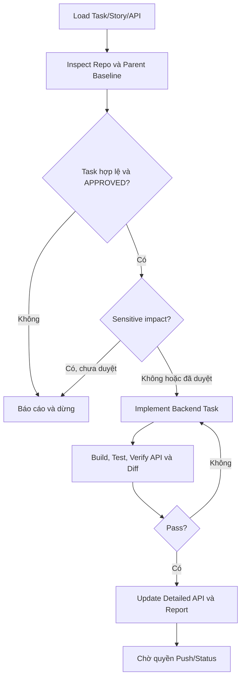

# Workflow: Execute Approved Backend Task

## Description

Thực thi hoặc sửa một Task Backend đã được Human duyệt.

## Triggers

- User yêu cầu thực thi Task ID cụ thể.
- Task có `task-spec.md` và Human Approval hợp lệ.

## Mermaid Diagram

## Steps

| # | Action | Skill | Output |
|---|---|---|---|
| 1 | Nạp Task, Story và API context | MCP/filesystem wrappers | Execution context |
| 2 | Xác nhận repo, working tree, parent branch và code liên quan | `inspect-repository-context` | Baseline |
| 3 | Xác nhận approval, file boundary và sensitive impact | Task contract/rules | Gate result |
| 4 | Code đúng endpoint/Task theo conventions hiện hữu | `clean-code-implementation` | Source changes |
| 5 | Build, test, verify API/diff và secrets | `verify-backend-task` | Evidence report |
| 6 | Đối chiếu Detailed API với implementation thực tế | `create-api-spec` | Updated spec |

Thiếu context, guideline, approval, parent, repository match hoặc output path bắt buộc thì trả `BLOCKED_*`, yêu cầu đúng resource cần cung cấp và ghi `CHANGES_MADE: NONE`.

## Definition of Done

- [ ] Chỉ phạm vi Task được thay đổi.
- [ ] Build/test theo policy pass và có bằng chứng.
- [ ] Detailed API khớp implementation.
- [ ] Diff được so với đúng parent.
- [ ] Chưa tự push, merge hoặc đổi trạng thái `DONE`.
