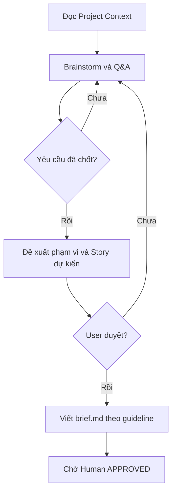

# Workflow: Epic Creation

## Description

Tạo Epic Brief từ yêu cầu đã được brainstorm trong một Project Workspace hiện hữu.

## Triggers

- User yêu cầu tạo Epic mới hoặc hoàn thiện Epic Brief.

## Mermaid Diagram

## Steps

| # | Action | Skill | Output |
|---|---|---|---|
| 1 | Đọc overview, context và lịch sử liên quan | `fetch-guideline`, MCP/filesystem | Project context |
| 2 | Phân tích và Q&A tối đa 5 câu/lượt | `requirement-clarification`, `requirement-analysis` | Quyết định nghiệp vụ |
| 3 | Đề xuất phạm vi và danh sách Story dự kiến | `solution-design` | Scope được duyệt |
| 4 | Viết theo `guideline://EPIC/brief.md` | `write-epic-specs` | `brief.md` |
| 5 | Lưu local; đồng bộ MCP nếu khả dụng | `save-epic-local`, local MCP wrappers | Epic Draft |

## Definition of Done

- [ ] Yêu cầu, scope, dependency và risk đã được user chốt.
- [ ] Chỉ `brief.md` là tài liệu Epic chính thức.
- [ ] Danh sách Story trong Brief được ghi là dự kiến cho tới khi chi tiết hóa.
- [ ] Lina chưa tự đặt trạng thái `APPROVED`.
