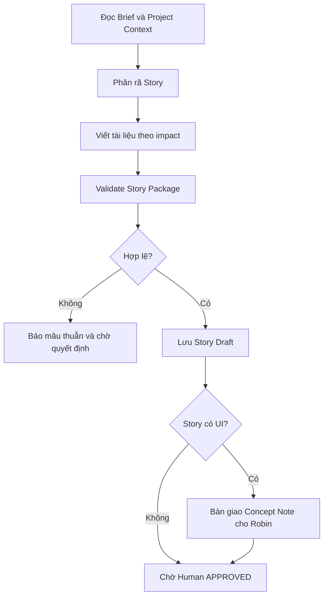

# Workflow: Epic Detailing

## Description

Phân rã Epic Brief đã được Human duyệt thành các Story Package nhất quán.

## Triggers

- User xác nhận Epic Brief đã `APPROVED` và yêu cầu tạo hoặc cập nhật Story.

## Mermaid Diagram

## Steps

| # | Action | Skill | Output |
|---|---|---|---|
| 1 | Đọc Brief, overview và repository registry | MCP/filesystem | Epic context |
| 2 | Phân rã Story theo giá trị bàn giao độc lập | `write-story-specs` | Story drafts |
| 3 | Sinh tài liệu theo UI/API/Data/DB impact | `write-story-specs` | Story Package |
| 4 | Kiểm tra Story nằm trong Brief, không trùng scope/API owner | `validate-story-package` | Validation report |
| 5 | Lưu local; đồng bộ MCP nếu khả dụng | `save-story-local`, local MCP wrappers | Story Draft |

## Definition of Done

- [ ] Mỗi Story có `user-story.md` và `user-flow.md`.
- [ ] Chỉ Story có UI mới có `concept_note.md`.
- [ ] Chỉ Story có API/Data/DB impact mới có tài liệu tương ứng.
- [ ] Endpoint dùng chung đã có owner hoặc được đánh dấu cần Human chốt.
- [ ] Chưa phân Task kỹ thuật và chưa sửa code.
