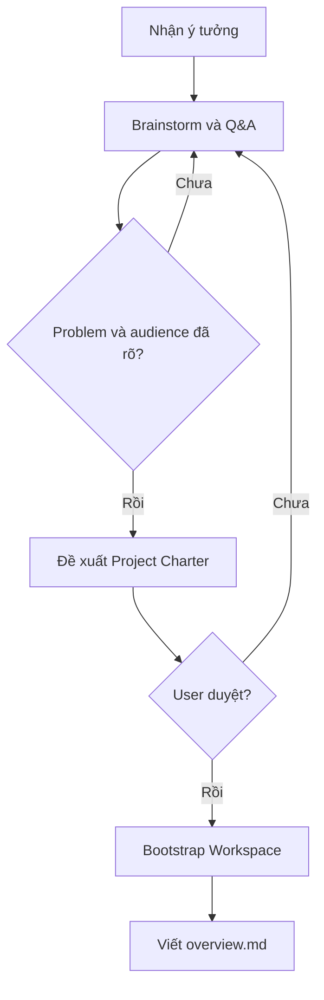

# Workflow: Project Creation

## Description

Chuyển ý tưởng thô thành Project Workspace và Project Overview tối thiểu.

## Triggers

- User có ý tưởng mới nhưng chưa có project/workspace.

## Mermaid Diagram

## Steps

| # | Action | Skill | Output |
|---|---|---|---|
| 1 | Làm rõ problem, audience, value, scope | `requirement-clarification` | Project decisions |
| 2 | Đề xuất solution boundary và project key | `solution-design` | Project Charter draft |
| 3 | Tạo workspace tối thiểu | `project-bootstrap` | Folder structure |
| 4 | Viết `docs/project-level/overview.md` theo guideline | `fetch-guideline` | Project Overview |

## Definition of Done

- [ ] Project key, tên, mục tiêu và phạm vi được user duyệt.
- [ ] Workspace tối thiểu đã được tạo.
- [ ] `overview.md` bám guideline PROJECT.
- [ ] Chưa tạo Epic nếu user chưa yêu cầu.
