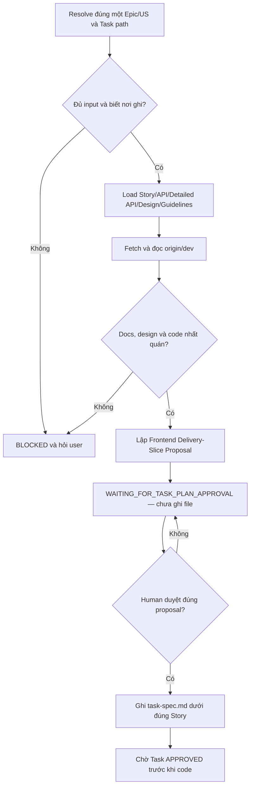

# Workflow: Decompose Frontend Tasks for One Story

## Trigger

User yêu cầu phân rã một `<EPIC>/<US>` cụ thể thành Frontend Tasks.
Không dùng workflow này cho toàn Epic hoặc nhiều US.

## Required Skills

Theo đúng thứ tự:

1. `get-context-story`
2. `inspect-repository-context`
3. `plan-frontend-delivery-slice`

## Flow



## Phase 1: Proposal

1. Resolve đúng một Epic/US và Task output path.
2. Thiếu US, có nhiều US hoặc không biết nơi ghi thì `BLOCKED` và hỏi user.
3. Dùng `get-context-story` nạp Story/API/Detailed API hoặc Human-approved planning source/design/approval.
4. Đọc TASK_FE guideline và branch rules.
5. Fetch `origin/dev`; dùng `inspect-repository-context` đọc code trực tiếp từ baseline.
6. Đọc Task cùng Epic để tránh ownership trùng.
7. Dùng `plan-frontend-delivery-slice` lập Task Proposal cho đúng US.
8. Trình Task matrix và trả `WAITING_FOR_TASK_PLAN_APPROVAL`; chưa ghi file.

## Phase 2: Write

Chỉ chạy khi user duyệt rõ proposal hiện có và đúng Epic/US.

1. Ghi Task Spec đúng guideline dưới Story.
2. Không tự sinh thêm Task ngoài proposal.
3. Không tạo Detailed API phía FE.
4. Không code, tạo branch, push hoặc đổi `DONE`.
5. Báo file đã tạo và chờ Human duyệt Task để code.

## Blocked Response

```text
STATUS: BLOCKED_<REASON>
WORKFLOW: DECOMPOSE_FRONTEND_TASKS
SCOPE: <EPIC>/<US hoặc UNKNOWN>
MISSING_OR_CONFLICT: <chi tiết>
ATTEMPTED_SOURCES: <MCP URI, local path và Git ref đã thử>
USER_ACTION_REQUIRED: <US/path/resource/quyết định cần user cung cấp>
CHANGES_MADE: NONE
```
