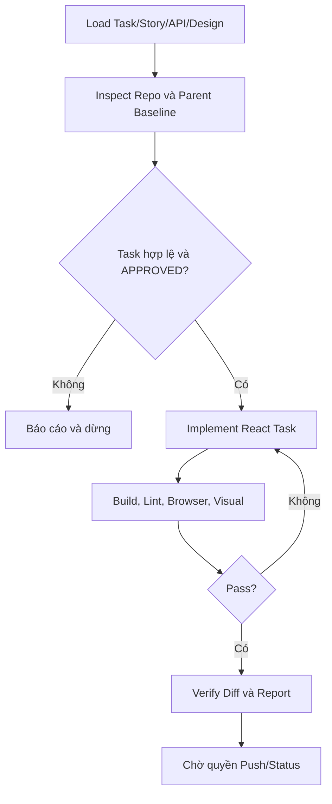

# Workflow: Execute Approved Frontend Task

## Description

Thực thi hoặc sửa một Task FE đã được Human duyệt.

## Triggers

- User yêu cầu thực thi Task ID cụ thể.
- Task có `task-spec.md` và trạng thái Human Approval hợp lệ.

## Mermaid Diagram

## Steps

| # | Action | Skill | Output |
|---|---|---|---|
| 1 | Nạp Task, Story, API và design context | MCP/filesystem wrappers | Execution context |
| 2 | Xác nhận repo, working tree, parent branch, stack và code liên quan | `inspect-repository-context` | Baseline |
| 3 | Xác nhận Task `APPROVED`, allowed/forbidden files và branch rules | Task contract/rules | Gate result |
| 4 | Code theo conventions và tái sử dụng component/API client hiện có | `react-implementation` | Source changes |
| 5 | Build, lint, browser/visual check và verify diff | `verify-frontend-task` | Evidence report |

Thiếu context, guideline, API/design, approval, parent, repository match hoặc output path bắt buộc thì trả `BLOCKED_*`, yêu cầu đúng resource cần cung cấp và ghi `CHANGES_MADE: NONE`.

## Definition of Done

- [ ] Chỉ phạm vi Task được thay đổi.
- [ ] Build và lint pass; browser/visual evidence được ghi.
- [ ] Diff được so với đúng parent của Task.
- [ ] Chưa tự push, merge hoặc đổi trạng thái `DONE`.
